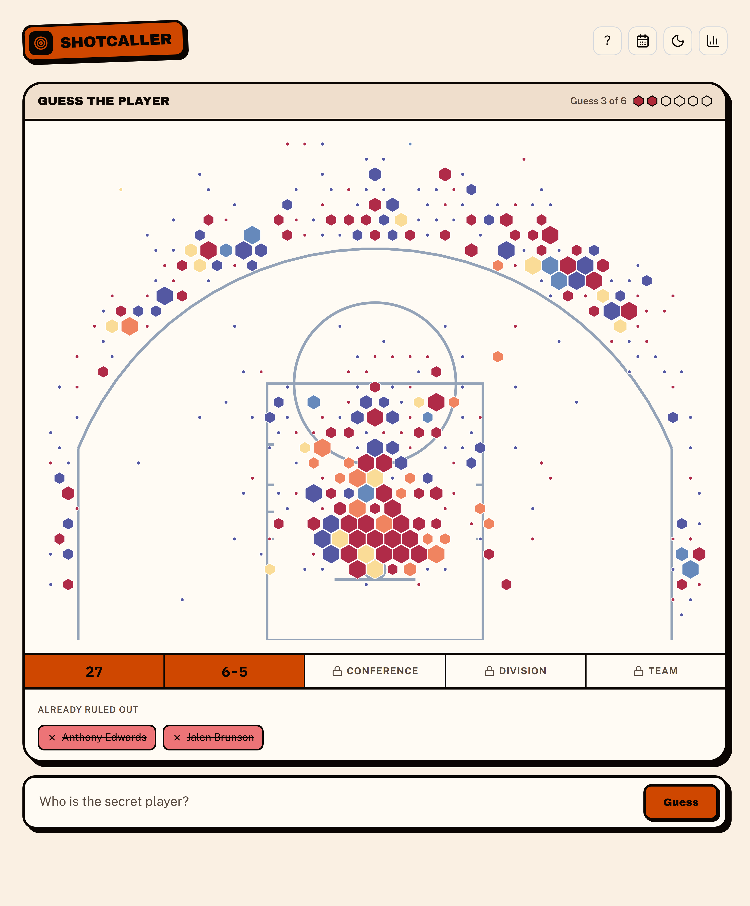

# Shotcaller

[](https://shotcaller-game.vercel.app/)

A daily NBA guessing game. You get one player's shot chart — every spot on the
court they shot from this season, sized by how often they shot from there and
colored by how well they shot compared to the rest of the league — and six
guesses to name them.



Built with Next.js, TypeScript and d3 scales on the front, a Python pipeline
over 219,000 NBA shot records on the back.

---

## Three problems worth reading about

### Color had to mean the same thing on every chart

Shooting 40% is excellent from 27 feet and poor at the rim. Comparing a player
against one league-wide average would have painted every big man red and every
guard blue — the map would describe position, not skill.

So a hexagon's color is the player's FG% there minus the league's FG% **at that
same hexagon**, pooled across every shot in the dataset, on a fixed ±15 point
scale that is never recalibrated per player. Two players who shoot the same
percentage from the same spot get the same color, which is what makes today's
chart comparable to yesterday's.

Size is calibrated per player instead, by quantile — attempt counts are skewed
enough that a linear scale renders most of a chart as invisible specks.

→ [`data/data_processor.py`](data/data_processor.py) · [`web/src/components/ShotChart.tsx`](web/src/components/ShotChart.tsx)

### The answer used to be sitting in the network tab

The player index was public, the daily draw ran in the browser, and the network
tab showed `GET /data/players/1627759.json`. Ten seconds to the answer, without
reading a line of source. Hiding the draw wouldn't have fixed it either — all
130 player files were public, and a shot chart identifies a player about as well
as their name does.

The fix was to move the answer to the server and treat every response as an
**allowlist, assembled field by field**:

```ts
answer: status === "playing" ? null : player.name
```

No player id (the public index maps ids to names). `hints` carries only the
values already revealed, never the full set with a flag — the client is
structurally incapable of showing a clue it shouldn't have, because it never
receives one. Game state lives in a signed `httpOnly` JWT cookie holding
`{ day, guesses }` and nothing else; status is derived server-side.

→ [`web/src/lib/secret.ts`](web/src/lib/secret.ts) · [`web/src/app/api/game/route.ts`](web/src/app/api/game/route.ts)

### Refreshing the data could rewrite the past

The draw picked a seeded random position in the player list — so the answer
depended on the order and length of a file the pipeline regenerates. Growing the
roster from 130 to 131 players silently changed which player a **past** day
resolved to. That breaks archive mode, and it breaks two friends comparing the
same `3/6`.

Rosters are now versioned by date in `pools.json`, and `poolForDay` takes the
last entry whose `from <= day` — so a past day is permanently unable to see a
pool created after it. Dates are compared as strings, since `YYYY-MM-DD` is
fixed-width and sorts chronologically, which removes time zones from the
comparison entirely. The processor deliberately does not generate that file; if
it did, the bug would come straight back.

→ [`web/data/pools.json`](web/data/pools.json) · [`data/validate_output.py`](data/validate_output.py)

---

## Layout

```
data/            collection, processing and validation (Python)
raw_data/        per-player shot records, as pulled from the NBA API
web/data/        server-only: player hexes, pools.json
web/public/data/ public: player index, league hexagon stats
web/src/lib/     game rules (client) and answer handling (server), both tested
```

## Running it

```bash
cd web
npm install
npm run dev          # needs SESSION_SECRET in web/.env.local
```

```bash
npx tsc --noEmit     # next dev does not check types
npm test             # game rules, session signing, the daily draw
```

Data files are committed, because Vercel clones the repo and doesn't run Python.
Regenerating them is a separate, occasional step:

```bash
python data/data_processor.py
python data/validate_output.py
```
